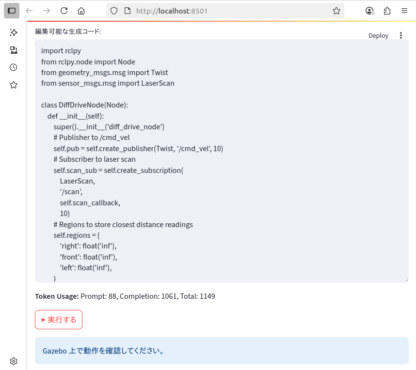

# 自然言語を用いた LLM によるロボット操作

`Code Name: pai_llm_operation`

このリポジトリは、松尾・岩澤研講義「Physical AI 知能ロボティクス講座 2025 Spring」の以下の最終課題の成果物の一つであり、人間の自然言語による指示をもとに、LLMが生成した Python コードによる、ROS2 で実装されたロボットの操作を行うアプリおよびスクリプト群です。


## 1. 最終課題

### 1-1. 最終課題概要

#### 課題名：AI×ロボティクスによる創造的タスクの実現
#### 目的：AI技術を活用し、ロボットが実行するタスクを設計・実装することで、創造性と技術力を発揮する。
#### 対象：PhysicalAI講座の受講者
#### 提出物：
* ロボットがタスクを実行する様子を収めた動画（1分〜5分以内、倍速再生可。倍速の場合は明記）
* 使用したコード一式 (このリポジトリ)
* 課題の概要や目的、工夫した点などを記載した簡単なレポート (`README.md`)


### 1-2. 最終課題詳細

#### 使用ツール：講義で使用したROSとGazebo、Genesisなどのロボットシミュレータを使用することを想定しているが、他のツールの使用及び実機を動かしての撮影も可とする
#### AIの活用：何らかの形でAIを使用することを必須とする。推論のみでも可。学習は任意。
#### タスクの自由度：参加者が自由に設定したタスクをロボットに実行させる。
#### 動画の要件：
* 長さは1分〜5分以内。
* 倍速再生を使用する場合は、その旨（例：2倍速）を明記。
#### コードの提出：使用したコード一式を提出。
#### 課題の概要や目的、工夫した点などを記載した簡単なレポート


### 1-3. 評価基準
#### 合格ライン：ロボットがタスクを実行している動画を提出すれば合格。
#### 加点要素：
* 創造性：独自性のあるアイデアやアプローチ。
* 技術力：高度な技術や複雑な制御の実装。
* 実用性：現実世界での応用可能性。
* 表現力：動画の構成や説明のわかりやすさ。
    #### 他人の作品の剽窃、最終課題サンプルの丸写し、明らかに関係のないファイルの提出など、悪質な行為は講義の終了判定対象外となる可能性あり。

## 2. プロジェクトの目的
* 最終課題を取り組むにあたり紹介のあった以下の[事例](https://qiita.com/porizou1/items/a085d20e936946330540)をもとに、
* 人間の自然言語での指示をもとに、LLM が生成する Python コードでロボットを操作するシステムの構築。
* ROS2 と Gazebo 環境を用いたロボット操作の自動化と、ユーザーフレンドリーなインターフェースの実現。
* **上記に加え、ロボット実機を用いた操作にも挑戦する。**(Ch.7)


### 参考にした最終課題サンプル

|タイトル                                               |URL                                                |難易度|
|-----------------------------------------------------|----------------------------------------------------|:---:|
|ChatGPT APIによる自然言語ロボット操作<br> (APIの提供は不可)|https://qiita.com/porizou1/items/a085d20e936946330540|上級|


## 3. 開発環境

* MacBookAir (Apple M3) macOS: Sequoia 15.5
* 講義で用いた「第2版 ROS2とPythonで作って学ぶAIロボット入門」の docker イメージ (`airobotbook/ros2-desktop-ai-robot-book-humble`) による演習環境を、をブラウザから利用

  #### Docker 起動スクリプト (http://localhost:6080 でアクセス可能)
  ```bash
  docker run \
  -e RESOLUTION=1920x1080 \
  --name pai_ros2 \
  -p 15900:5900 \
  -p 13389:3389 \
  -p 9090:9090 \
  -p 9876:9876 \
  -p 6080:80 \
  --shm-size=512m \
  --privileged \
  airobotbook/ros2-desktop-ai-robot-book-humble
  ```

  #### 稼働状況の確認
  ```bash
  docker ps
  CONTAINER ID   IMAGE                                           COMMAND                   CREATED       STATUS       PORTS                                                                                                                    NAMES
  f6719b01d06e   airobotbook/ros2-desktop-ai-robot-book-humble   "/bin/bash -c /entry…"   3 weeks ago   Up 2 hours   0.0.0.0:9090->9090/tcp, 0.0.0.0:9876->9876/tcp, 0.0.0.0:6080->80/tcp, 0.0.0.0:13389->3389/tcp, 0.0.0.0:15900->5900/tcp   pai_ros2 
  ```

  #### ROS2 で動くロボットの Gazebo 環境をインストール
  [参考サイト](https://qiita.com/porizou1/items/a085d20e936946330540)に従い、/cmd_velで動かすことのできるロボットのシミュレーション環境を用意。<br>
  Turtlebot3 の Gazebo シミュレーション環境をインストール。
  ```bash
  sudo apt install ros-humble-turtlebot3-simulations
  ```

  #### Python モジュールのインストール
  ```
  pip install -r requirement.txt
  ```


  #### 開発環境の停止 (docker imageを消さない限り作業結果は保存される)
  ```bash
  docker stop pai_ros2
  ```
  
  #### 開発環境の再開
  ```bash
  docker start pai_ros2
  ```


## 4. 要件定義・設計

### 4-1. ファイル・ディレクトリ構成
   ```bash
  pai_llm_operation
  ├── generate_and_run_python_script.py ← LLMへ指示と指示に基づくコードを生成 (参考サイトのコードをベースに修正) (*)
  ├── generated_script.py            　 ← 上記で生成されたコード
  ├── .env                              ← 環境設定ファイル (サンプルは、.env.example)
  ├── pre_prompt.txt                    ← 生成させるコードの品質を維持するための固定(事前)プロンプト
  ├── app.py                            ← 利用者からのプロンプト等を受け付ける Streamlit を利用した UI
  ├── launch
  │   └── empty2_world.launch.py        ← カメラ角度を調整した Gazebo 用 world 定義ファイル
  ├── requirements.txt                  ← Python依存パッケージ一覧
  └── README.md                         ← このファイル

   (*) 単体での実行も可能
  ```


### 4-2. LLM の利用
  * LLM は以下のシーンで利用
    1. 事前プロンプトとユーザーからのロボット動作指示プロンプトに基づき、ロボットを操作するための、rclpy ベースのコードを生成
    2. API Token 使用料も表示


### 4-3 LLM API プロバイダー比較

- 以下の8つのポイントで、OpenAI、Google Gemini、Anthropic Claude を比較。総合評価より OpenAI の`gpt-3.5-turbo`または`o4-mini`を採用。
- ただし、将来の拡張を考慮し、次点の Google Gemini、Anthoropic Claude、AWS Bedrock なども使えるように、コードの拡張を検討する。

| 比較項目                       | OpenAI (GPT)                                                            | 評価 | Google Gemini[^1]                                                            | 評価 | Anthropic Claude[^2]                                                         | 評価 |
|--------------------------------|-------------------------------------------------------------------------|:----:|---------------------------------------------------------------------------|:----:|---------------------------------------------------------------------------|:----:|
| 1. モデル品質                  | GPT-4をはじめとする最先端モデルを提供。多言語対応・日本語性能も高く、生成品質は業界トップクラス。[^3] | ◯   | Gemini Ultraなど高性能モデルを提供。特に会話品質に強みがあり、Google検索との統合で最新情報にアクセス可能。 | ◯   | Claude 4など安全性重視の設計。生成品質は高いが、特定のタスクでGPTに一部劣るケースあり。 | △   |
| 2. APIの安定性・使いやすさ     | RESTベースのシンプルなエンドポイント、公式SDKが充実。サービス稼働率も高く、信頼性が実証済み。[^4]         | ◯   | Google Cloud上で提供、Cloud SDKやgRPC対応。Googleインフラの信頼性が強み。               | ◯   | 独自APIを提供。ドキュメントは整備されているが、SDKは限定的。API仕様変更の頻度は低い。   | △   |
| 3. ドキュメント・エコシステム   | 豊富なサンプルコードやチュートリアル、コミュニティサポートが充実。公式ブログ・論文も多数。[^5]            | ◯   | Google Cloudドキュメントと統合^。チュートリアルは多いが、LLM向け部分はまだ発展途上。    | △   | セキュリティ重視の設計ガイドを含むドキュメントが提供。コミュニティは小規模だが質の高い事例共有あり。 | △   |
| 4. 拡張性・将来性               | Fine-tuning, Function Calling, Embeddings等の周辺機能が豊富で、モデルアップデートも早期に提供。[^6]     | ◯   | Google Cloud AI製品群との連携やVertex AI統合でエコシステム拡張が容易。                | ◯   | 新機能追加を順次実施。安全性重視だが他社連携は限定的。長期ロードマップ公開。              | △   |
| 5. セキュリティ・コンプライアンス | SOC2/ISO27001取得済み。データ取り扱いポリシーが明確で、エンタープライズ利用に安心。[^7]                 | ◯   | Google Cloudのセキュリティ基盤を活用可能。VaultやIAMとの統合をサポート。           | ◯   | 社会的安全性重視。データは自社インフラ内で処理。                         | ◯   |
| 6. コスト透明性                | 従量課金モデルで初期投資不要。ダッシュボードで利用状況・コストを可視化可能。[^8]                        | ◯   | Cloud料金体系に準拠。複数サービスの組み合わせ料金を管理する必要がある。            | ◯   | 定額プラン中心。従量課金対応予定。可視化機能は限定的。                                    | △   |
| 7. コスト[^9]                   | gpt-3.5-turbo: $0.5/1M tokens, o4-mini: $1.1/1M input tokens                                   | ◯   | Gemini Pro: $1.25/1M input tokens                                             | △   | Claude Sonnet 4: $3.0/1M input tokens                                           | ×   |
| **8. 今回のタスクとの親和性**   | ROS2用rclpyノード生成において高い適合性。コード構造やAPI利用の指示に正確に対応。 | ◎ | 会話品質は高いが、ROS2コード生成、Gazebo プラグインの利用指示など複雑な API 呼び出し部分で誤ったコードが出力されるケースあり。 | △ | 安全性重視だが、複雑なコード生成には表現力不足。基本的なスクリプト生成には利用可能。 | △ |
| **総合評価**                   | **高い生成品質と安定性を備えたバランスの良い選択**                                          | **◎**    | 強力なインフラ連携と会話品質が魅力的                                            | △    | 安全性重視だが拡張性とコスト面で課題あり                                       | △    |

[^1]: https://cloud.google.com/vertex-ai/docs/generative-models/overview
[^2]: https://www.anthropic.com/products/claude
[^3]: https://platform.openai.com/docs/models/gpt-4
[^4]: https://platform.openai.com/docs/api-reference/introduction
[^5]: https://platform.openai.com/docs/
[^6]: https://platform.openai.com/docs/guides/fine-tuning
[^7]: https://openai.com/policies/security
[^8]: https://openai.com/pricing
[^9]: https://qiita.com/SH2/items/39314152c0a6f9a7b681


### 4-4. LLM利用時のプロンプト設計

1. 事前プロンプトとユーザーからのロボット動作の指示に基づくコード生成を依頼
    - システムプロンプト： なし
    - ユーザープロンプト：
      - `import rclpy`で始まる Python コードのみを確実に生成させるため、以下の事前プロンプトを設定。
      - 事前プロンプト ([参考サイト](https://qiita.com/porizou1/items/a085d20e936946330540)のものを利用)
        ```bash
        I need rclpy code to run a differential two-wheeled robot.
        Publish /cmd_vel every 0.1 seconds.
        Please only write Python code in your replies.
        Reply by. import rclpy Please start with
        QoS is not set
        ```
      - ユーザーからの具体的な指示 (日本語も可)、例:「0.2m/sで前に進む。3m進んだら60度右に旋回。これを繰り返して。」


### 4-5. 生成されたコードの編集と実行

* ユーザープロンプトにより生成されたコードについては、即実行 (Beginnerモード)と、編集してから実行 (Expertモード) を2つを設ける。


## 5. 開発・工夫した点

### 5-1. Gazebo 環境構築・ロボット操作準備

* Gazebo 上の以下2種類の world を構築・準備した。

#### 5-1-1. Case #1 Gazebo Empty World

* Gazebo 上で、まっさらな平面にロボットを配置する。
 
  Turtlebot3 付属の`empty_world.launch.py`ではカメラの位置が真上のため、複製してから修正する。
  ```
  cd ~/airobot_ws/src/turtlebot3_happy_mini/turtlebot3_simulations/turtlebot3_gazebo/launch
  cp empty_world.launch.py ~/airobot_ws/install/turtlebot3_gazebo/share/turtlebot3_gazebo/launch/empty2_world.launch.py
  ```
  カメラ位置を調整するため、Gazebo 付属の`world`を利用するよう変更
  ```
  #world = os.path.join(
  #    get_package_share_directory('turtlebot3_gazebo'),
  #    'worlds',
  #    'empty_world.world'
  #)
  world = '/usr/share/gazebo-11/worlds/empty.world'
  ```
  #### 以下実行して Gazebo 上にロボットを配置
  ```
  ros2 launch turtlebot3_gazebo empty2_world.launch.py 
  ```
  #### Topic の Publish を確認 (別ターミナル)
  ```
  ros2 topic echo /cmd_vel
  ```

#### 5-1-2. Case #2 Gazebo Big Wheel

* Gazebo 上で、Big Wheel 上にロボットを配置する。

  #### デフォルトパッケージを利用して Gazebo 上の Big Wheel ロボットを配置
  ```
  ros2 launch turtlebot3_gazebo turtlebot3_world.launch.py
  ```
  #### Topic の Publish を確認 (別ターミナル)
  ```
  ros2 topic echo /cmd_vel
  ```

### 5-2. CLI モード

  * CLI での操作は、以下を実行する。
  ```bash
  pyhton3 generate_and_run_python_script.py
  ```

  * `Please enter additional prompt text:` とロボットへの指示を入力するモードとなる。(入力例：0.2m/sで前に進む。3m進んだら60度右に旋回。これを繰り返して)
  
  * 出力されたコードは即実行される。
  * `ros2 topic echo /cmd_vel` を実行しているターミナルに、0.2m/s で前に動く等のトピックが Publish される。
  * 以下は、出力の様子。ユーザー指示プロンプトを入力後、LLM　API 利用し、指示に基づいたコードが生成され、Gazobo 上のロボットを操作。
    ```
    ubuntu@f6719b01d06e:~/pai_llm_operation$ python3 generate_and_run_python_script.py 
    Please enter additional prompt text:
    0.2m/sで前に進む。3m進んだら60度右に旋回。これを繰り返して。

    2025-07-13 18:43:31 INFO HTTP Request: POST https://api.openai.com/v1/chat/completions "HTTP/1.1 200 OK"
    Token usage - prompt: 91, completion: 1366, total: 1457  ← 消費トークン数
    Generated code:  ← 以降は、生成されたコード
    import rclpy
    from rclpy.node import Node
    from geometry_msgs.msg import Twist
    import math

    class DiffDriveController(Node):
        def __init__(self):
            super().__init__('diff_drive_controller')
            self.cmd_pub = self.create_publisher(Twist, '/cmd_vel', 10)
            self.timer = self.create_timer(0.1, self.timer_callback)

            # motion parameters
            self.linear_speed = 0.2               # m/s
            self.distance = 3.0                   # m
            self.forward_duration = self.distance / self.linear_speed

            self.turn_angle = math.radians(60)    # radians
            self.angular_speed = 0.5              # rad/s
            self.turn_duration = self.turn_angle / self.angular_speed

            # state machine
            self.state = 'forward'
            self.state_start = self.get_clock().now()

        def timer_callback(self):
            now = self.get_clock().now()
            elapsed = (now - self.state_start).nanoseconds * 1e-9

            twist = Twist()

            if self.state == 'forward':
                if elapsed < self.forward_duration:
                    twist.linear.x = self.linear_speed
                    twist.angular.z = 0.0
                else:
                    # switch to turn
                    self.state = 'turn'
                    self.state_start = now
                    twist.linear.x = 0.0
                    twist.angular.z = -self.angular_speed
            elif self.state == 'turn':
                if elapsed < self.turn_duration:
                    twist.linear.x = 0.0
                    twist.angular.z = -self.angular_speed
                else:
                    # switch back to forward
                    self.state = 'forward'
                    self.state_start = now
                    twist.linear.x = self.linear_speed
                    twist.angular.z = 0.0

            self.cmd_pub.publish(twist)

    def main(args=None):
        rclpy.init(args=args)
        node = DiffDriveController()
        try:
            rclpy.spin(node)
        except KeyboardInterrupt:
            pass
        node.destroy_node()
        rclpy.shutdown()

    if __name__ == '__main__':
        main()
    
    ```

### 5-3. GUI モード (Streamlit 利用)

* ブラウザベースの GUI モードは、以下を実行する。ラジオボタンで、Beginner と Expert 2つのモードが選択可能。
  ```
  streamlit run app.py
  ```

  1. Beginner モード

      * ロボット操作指示のユーザープロンプトを入力し、コード生成した後、生成されたコードを自動実行する
          * 以下はユーザープロンプトの入力後のコード生成中の画像<br><br>
            

          * コード生成が完了すると、コードが実行され、Gazebo上での確認を促される<br><br>
            

          * コード生成完了後、消費したAPIトークン数を表示<br><br>
            

   <br>

   2. Expert モード
      * ロボット操作指示のユーザープロンプト入力し、コード生成した後、必要に応じコードを修正し、そのコードを実行する
          * ユーザープロンプトの入力後のコード生成中<br><br>
              

          * コード生成が完了すると、コードは編集可能となる。消費したトークンも表示。<br><br>
              

          * 編集 (必須ではない) 後、コードを実行し、Gazebo上での確認を促される。<br><br>
              


### 5-4. 環境変数
* LLM API モデル, API Token, 事前プロンプトをハードコードせず、容易に変更できるよう等、環境変数とした。


### 5-5. LLM API 利用時の Token 数の表示
* LLM 利用時のToken 数を表示することにより、API 利用料の試算を可能とした。


### 5-6. Streamlit を用いた、Webブラウザ UI の実装
* Streamlit を利用し、UI をブラウザ (GUI) を利用することにより、ロボットへの指示を容易にした。
* Expert モードを実装し、LLM により生成されるコードの編集・実行を可能とした。


## 6. 開発環境における考察・評価

開発環境における LLM によるコード生成によるロボット操作について、以下の通り考察・評価を行った。

### 6-1. 前提

* LLM (o4-mini) が生成するコードにはエラーが発生するものはなく、一定のコードの品質は確保されているものと思料。

### 6-2. Gazebo Empty World

* 以下のプロンプトでロボットを操作 (Bigginer モード)
    * 0.2m/sで前に進む。5m進んだら戻って。これを繰り返して。
        * 出力されるコードに問題なく、プロンプト通り動作した。

    * 0.2m/sで前に進む。5m進んだら45度旋回。これを繰り返して。
        * 出力されるコードに問題なく、プロンプト通り動作した。


### 6-3. Gazebo Big Wheel

* 以下のプロンプトでロボットを操作 (Bigginer モード)
    * 0.5m/sで前に進む。壁と障害物をよけて。これを繰り返して。
        * まっすぐ進み、壁にあたり、旋回するケース、白い障害物をの周りを回るケースなど、様々なコードが生成された。

    * 0.3m/sで前に進む。壁や障害物に触れたら方向転換して前進して。常に直立した体制を保持。これを繰り返して。
        * まっすぐ進み、壁にあたり、旋回するが、ロボット自体が横転するケースが多かった。姿勢の維持には別のプロンプトが必要か？

    * 0.3m/sで前に進む。ジグザグに進む。壁と障害物をよけて。これを繰り返して。
        * ジグザグに進み、障害物をよけていくが、白い障害物の周りを回り続けるケースもあり。

    * ロボットを左に60度旋回させてから、前方に 0.3m/s で走らせながら、LiDAR（/scan トピック）で前方の障害物を検知してください。障害物が 0.5m以内に入ったらいったん停止し、左右どちらにより余裕があるかを比較してその方向へアーク旋回し、進行方向がクリアになったら再び前進するように動作させてください。10Hz のタイマーで /scan の受信と /cmd_vel への命令送信を両方行うコードを書いてください。
        * 障害物や壁に近づいた際にこれらを検知し、速度を落として旋回 (アーク旋回) することで、ロボットが横転せず姿勢を維持しながら、障害物や壁を回避して進行を続けることができた。
        * (参考) このとき生成されたコードは以下の通り。
            ```
            import rclpy
            from rclpy.node import Node
            from sensor_msgs.msg import LaserScan
            from geometry_msgs.msg import Twist
            import math
            import time

            class DifferentialDriveAvoider(Node):
                def __init__(self):
                    super().__init__('differential_drive_avoider')
                    self.pub = self.create_publisher(Twist, '/cmd_vel', 10)
                    self.sub = self.create_subscription(LaserScan, '/scan', self.scan_callback, 10)
                    self.timer = self.create_timer(0.1, self.timer_callback)
                    self.latest_scan = None

                    # state machine: 'rotating_initial', 'moving_forward', 'turning'
                    self.state = 'rotating_initial'
                    self.start_time = None

                    # initial rotation parameters: rotate left 60 deg at 0.5 rad/s
                    self.rotate_speed = 0.5
                    self.rotate_angle = math.radians(60.0)
                    self.rotate_duration = self.rotate_angle / self.rotate_speed

                    # forward speed
                    self.forward_speed = 0.3

                    # avoidance arc turn parameters
                    self.arc_linear = 0.1
                    self.arc_angular = 0.5
                    self.turn_direction = 1  # +1 left, -1 right

                def scan_callback(self, msg):
                    self.latest_scan = msg

                def timer_callback(self):
                    if self.state == 'rotating_initial':
                        now = time.time()
                        if self.start_time is None:
                            self.start_time = now
                        elapsed = now - self.start_time
                        twist = Twist()
                        if elapsed < self.rotate_duration:
                            twist.angular.z = self.rotate_speed
                        else:
                            self.state = 'moving_forward'
                            twist.angular.z = 0.0
                        self.pub.publish(twist)

                    elif self.state == 'moving_forward':
                        twist = Twist()
                        if self.latest_scan is None:
                            # no data yet, just stop
                            twist.linear.x = 0.0
                            self.pub.publish(twist)
                            return
                        min_front = self.get_min_in_sector(self.latest_scan, -15.0, 15.0)
                        if min_front < 0.5:
                            # obstacle detected: stop and decide turn
                            twist.linear.x = 0.0
                            self.pub.publish(twist)
                            left_clear = self.get_min_in_sector(self.latest_scan, 30.0, 90.0)
                            right_clear = self.get_min_in_sector(self.latest_scan, -90.0, -30.0)
                            self.turn_direction = 1 if left_clear > right_clear else -1
                            self.state = 'turning'
                        else:
                            # path clear: go forward
                            twist.linear.x = self.forward_speed
                            self.pub.publish(twist)

                    elif self.state == 'turning':
                        twist = Twist()
                        if self.latest_scan is None:
                            twist.linear.x = 0.0
                            twist.angular.z = 0.0
                            self.pub.publish(twist)
                            return
                        min_front = self.get_min_in_sector(self.latest_scan, -15.0, 15.0)
                        if min_front > 0.5:
                            # path cleared: stop turning, resume forward
                            self.state = 'moving_forward'
                            twist.linear.x = 0.0
                            twist.angular.z = 0.0
                            self.pub.publish(twist)
                        else:
                            # arc turn toward clearer side
                            twist.linear.x = self.arc_linear
                            twist.angular.z = self.turn_direction * self.arc_angular
                            self.pub.publish(twist)

                def get_min_in_sector(self, scan: LaserScan, start_deg: float, end_deg: float) -> float:
                    """Return the minimum range in the angular sector [start_deg, end_deg]."""
                    ang_min = scan.angle_min
                    inc = scan.angle_increment
                    ranges = scan.ranges
                    start_rad = math.radians(start_deg)
                    end_rad = math.radians(end_deg)
                    min_range = float('inf')
                    for i, r in enumerate(ranges):
                        if math.isfinite(r):
                            angle = ang_min + i * inc
                            if start_rad <= angle <= end_rad:
                                if r < min_range:
                                    min_range = r
                    return min_range

            def main(args=None):
                rclpy.init(args=args)
                node = DifferentialDriveAvoider()
                rclpy.spin(node)
                node.destroy_node()
                rclpy.shutdown()

            if __name__ == '__main__':
                main()
            ```


### 6-4. 開発環境における LLM が生成するコードの性能評価

* Gazebo で設定する World (障害物の数、配置) が単純なものでは、生成されるコードにより、指示通りロボットを操作できることを確認。
* 一方で、World が複雑になるなるほど、想定外の動き (ロボットの横転等) があり、改善の余地があることを確認。
* LiDARの利用や、障害物を旋回して回避することについての細かな指示を与えることにより、生成されるコードとロボットの動作に大きな改善がみられた。


## 7. 実機環境

### 7-1. MicroROS-Pi5 Robot Car

* 実機環境には、コストを考慮し、車輪とLiDARが実装された開発環境に近い、ROS2-Humble を使った Yahboom 社の MicroROS-Pi5 Robot Car を用いた。
* 実機環境は Raspberry Pi 5 (Raspberry Pi OS Bookworm) 上に Docker Container `yahboomtechnology/ros-humble:4.1.2` と `microros/micro-ros-agent` で構築されている。
* コンテナ上の実機環境では、以下のトピックが利用可能であり、開発環境と同じく、LLMから、車輪の操作 `/cmd_vel` と LiDAR の利用`/scan`を利用する。
    ```
    root@roscarpi:~# ros2 topic list
    /JoyState
    /battery
    /beep
    /cmd_vel
    /imu
    /joy
    /joy/set_feedback
    /move_base/cancel
    /odom_raw
    /parameter_events
    /rosout
    /rpi5_ip
    /scan
    /servo_s1
    /servo_s2
    root@roscarpi:~# 
    ```
* Yahboom 社の MicroROS-Pi5 Robot Car の仕様は、[リンク](https://www.yahboom.net/study/MicroROS-Pi5)を参照。
* 上記リンクに従い、WiFi Hot Spotモードに加え、通常のWiFiにも接続できるようにする。

### 7-2. 実装

* コンテナ上に開発環境と同じファイルを以下のように配備する。
 ```bash
  pai_llm_operation
  ├── generate_and_run_python_script.py ← LLMへ指示と指示に基づくコードを生成 (参考サイトのコードをベースに修正) (*)
  ├── generated_script.py            　 ← 上記で生成されたコード
  ├── .env                              ← 環境設定ファイル (サンプルは、.env.example)
  ├── pre_prompt.txt                    ← 生成させるコードの品質を維持するための固定(事前)プロンプト
  ├── app.py                            ← 利用者からのプロンプト等を受け付ける Streamlit を利用した UI
  ├── launch
  └── requirements.txt                  ← Python依存パッケージ一覧

   (*) 単体での実行も可能
  ```
* コンテナ上での環境構築

  証明書の取得  
  ```bash
  sudo curl -sS https://raw.githubusercontent.com/ros/rosdistro/master/ros.key -o /usr/share/keyrings/ros-archive-keyring.gpg
  ```

  /etc/apt/sources.list.d/ros2-latest.list の編集  
  ```bash
  deb [arch=amd64 signed-by=/usr/share/keyrings/ros-archive-keyring.gpg] http://packages.ros.org/ros2/ubuntu jammy main
  ```

  Python 仮想環境構築  
  ```bash
  sudo apt update
  sudo apt install python3.10-venv -y
  python3 -m venv venv
  source ./venv/bin/activate
  ```

  依存するパッケージのインストール  
  ```bash
  (venv) root@roscarpi:~/pai_llm_operation# cat requirements.txt 
  openai
  python-dotenv
  streamline
  (venv) root@roscarpi:~/pai_llm_operation# pip install -r requirements.txt
  ```

  アプリの起動  
  ```bash
  (venv) root@roscarpi:~/pai_llm_operation# streamlit run app.py

      👋 Welcome to Streamlit!

      If you'd like to receive helpful onboarding emails, news, offers, promotions,
      and the occasional swag, please enter your email address below. Otherwise,
      leave this field blank.

      Email:  

  You can find our privacy policy at https://streamlit.io/privacy-policy

  Summary:
  - This open source library collects usage statistics.
  - We cannot see and do not store information contained inside Streamlit apps,
    such as text, charts, images, etc.
  - Telemetry data is stored in servers in the United States.
  - If you'd like to opt out, add the following to ~/.streamlit/config.toml,
    creating that file if necessary:

    [browser]
    gatherUsageStats = false


  You can now view your Streamlit app in your browser.

  Local URL: http://localhost:8501
  Network URL: http://192.168.xxx.xxx:8501
  ```
  
  LAN 内からブラウザで [http://192.168.xxx.xxx:8501](http://192.168.xxx.xxx:8501) (または Raspberry Pi から [http://localhost:8501](http://localhost:8501)) にアクセスし、開発環境と同じインターフェースを得る。LLM への指示によるロボット操作コードの生成の準備ができた。


## 8. 実機環境における考察・評価

実機環境における LLM によるコード生成によるロボット操作について、以下の通り考察・評価を行った。

### 8-1. 前提

* LLM (o4-mini) が生成するコードにはエラーが発生するものはなく、一定のコードの品質は確保されているものと思料。

### 8-2. 実機操作 (自宅廊下にカラーコーンを障害物として設置)

* 以下のプロンプトでロボットを操作 (Bigginer モード)
    * 0.2m/sで前に進む。3m進んだら止まって。
        * 出力されるコードに問題なく、プロンプト通り動作した。

    * 前方に 0.3m/s で直進しながら、LiDAR（/scan トピック）で前方 15° 範囲の障害物を検知してください。  
障害物が 0.3m 以内に入ったらいったん停止し、左右 90° それぞれの最小距離を比較して、よりスペースのある方向へアーク旋回（線速度 0.1m/s、角速度 ±0.5rad/s）してください。  
前方がクリア（0.5m 以上）になったら、再び 0.3m/s で前進するように動作を繰り返す、10Hz のタイマーで /scan と /cmd_vel を回す rclpy のコードを書いてください。
      * カラーコーンに近づいた際にこれらを検知し、速度を落として旋回 (アーク旋回) するが、カラーコーンは避けきれず、少しぶつかってしまうが、かろうじて避けている。壁に近づくと止まり、旋回して壁を回避している。しかし、壁で囲まれたところでスタックしてしまった。(提出した動画を参照)
      * (参考) このとき生成されたコードは以下の通り
        ```
        import rclpy
        from rclpy.node import Node
        from sensor_msgs.msg import LaserScan
        from geometry_msgs.msg import Twist
        import math

        class ObstacleAvoidanceNode(Node):
            def __init__(self):
                super().__init__('obstacle_avoidance')
                # QoS is not set
                # 前方に0.3m/sで直進しながら、LiDAR(/scan)で前方15°範囲の障害物を検知
                self.scan_sub = self.create_subscription(
                    LaserScan,
                    '/scan',
                    self.scan_callback,
                    10
                )
                self.cmd_pub = self.create_publisher(Twist, '/cmd_vel', 10)
                self.timer = self.create_timer(0.1, self.timer_callback)  # 10Hz
                self.front_min = float('inf')
                self.left_min = float('inf')
                self.right_min = float('inf')
                self.state = 'forward'
                self.turn_dir = None

            def scan_callback(self, msg: LaserScan):
                # 初期化
                self.front_min = float('inf')
                self.left_min = float('inf')
                self.right_min = float('inf')

                # 各方向の閾値（ラジアン）
                front_half = math.radians(7.5)
                left_center = math.pi / 2
                right_center = -math.pi / 2
                side_half = math.radians(15)

                angle = msg.angle_min
                for r in msg.ranges:
                    if not math.isfinite(r):
                        angle += msg.angle_increment
                        continue
                    if r < msg.range_min or r > msg.range_max:
                        angle += msg.angle_increment
                        continue

                    # 前方
                    if abs(angle) <= front_half:
                        if r < self.front_min:
                            self.front_min = r
                    # 左側
                    if left_center - side_half <= angle <= left_center + side_half:
                        if r < self.left_min:
                            self.left_min = r
                    # 右側
                    if right_center - side_half <= angle <= right_center + side_half:
                        if r < self.right_min:
                            self.right_min = r

                    angle += msg.angle_increment

            def timer_callback(self):
                cmd = Twist()

                if self.state == 'forward':
                    # 障害物検知
                    if self.front_min < 0.3:
                        # 停止してターンへ移行
                        cmd.linear.x = 0.0
                        cmd.angular.z = 0.0
                        self.cmd_pub.publish(cmd)
                        # 左右どちらにスペースがあるか比較
                        if self.left_min > self.right_min:
                            self.turn_dir = 'left'
                        else:
                            self.turn_dir = 'right'
                        self.state = 'turn'
                        return
                    # 前進継続
                    cmd.linear.x = 0.3
                    cmd.angular.z = 0.0

                elif self.state == 'turn':
                    # 前方がクリアになったら前進へ
                    if self.front_min > 0.5:
                        self.state = 'forward'
                        cmd.linear.x = 0.3
                        cmd.angular.z = 0.0
                    else:
                        # アーク旋回
                        cmd.linear.x = 0.1
                        if self.turn_dir == 'left':
                            cmd.angular.z = 0.5
                        else:
                            cmd.angular.z = -0.5

                self.cmd_pub.publish(cmd)

        def main(args=None):
            rclpy.init(args=args)
            node = ObstacleAvoidanceNode()
            try:
                rclpy.spin(node)
            except KeyboardInterrupt:
                pass
            node.destroy_node()
            rclpy.shutdown()

        if __name__ == '__main__':
            main()
        ```

### 8-3. 実機環境における LLM が生成するコードの性能評価

* カラーコーンや壁のない場所では、生成されるコードにより、指示通りロボットを操作できることを確認。
* カラーコーンは検知して旋回できるが、避けきれないケースが多く、LiDAR の仕様によるのか、早めの旋回を行わせるプロンプトが必要と思料。
* 壁のような垂直な障害物に対しては、検知して旋回し、回避することができた。一方で、壁が直角に重なる角に侵入してしまうと避けきれないケースがあった。
* 実機自体の大きさや、LiDAR の仕様に合わせたプロンプトが必要と認識。


## 9. 今後の展開

* Gazebo 等シミュレーション環境と、ロボット実機の同期の実現
* プロンプトと生成されるコードの関係性の解析
* ロボットの走行をシミュレーションさせるための障害物などの柔軟なレイアウト設定 (world 設定の習得)
* LLM が生成するコードの性能評価手法の確立
* 障害物等、複雑な環境下での、柔軟なロボット走行の実施のためのプロンプト作成
* OpenAI 以外の LLM API の利用による、生成されるコードの品質・性能比較

## 10. 脚注
