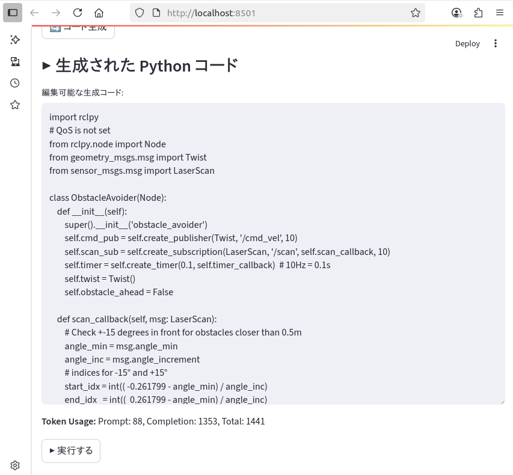

# LLM による自然言語をもとにしたロボット操作

`Code Name: pai_llm_operation`

このリポジトリは、松尾・岩澤研講義「Physical AI 知能ロボティクス講座 2025 Spring」の以下の最終課題の成果物の一つであり、人間の自然言語による指示をもとに、LLMが生成した Python コードによる、ROS2 で実装されたロボットの操作を行うアプリおよびスクリプト群です。


## 1. 最終課題

### 1-1. 最終課題概要

#### 課題名：AI×ロボティクスによる創造的タスクの実現
#### 目的：AI技術を活用し、ロボットが実行するタスクを設計・実装することで、創造性と技術力を発揮する。
#### 対象：PhysicalAI講座の受講者
#### 提出物：
* ロボットがタスクを実行する様子を収めた動画（1分〜5分以内、倍速再生可。倍速の場合は明記）
* 使用したコード一式 (このリポジトリ)
* 課題の概要や目的、工夫した点などを記載した簡単なレポート (`README.md`)


### 1-2. 最終課題詳細

#### 使用ツール：講義で使用したROSとGazebo、Genesisなどのロボットシミュレータを使用することを想定しているが、他のツールの使用及び実機を動かしての撮影も可とする
#### AIの活用：何らかの形でAIを使用することを必須とする。推論のみでも可。学習は任意。
#### タスクの自由度：参加者が自由に設定したタスクをロボットに実行させる。
#### 動画の要件：
* 長さは1分〜5分以内。
* 倍速再生を使用する場合は、その旨（例：2倍速）を明記。
#### コードの提出：使用したコード一式を提出。
#### 課題の概要や目的、工夫した点などを記載した簡単なレポート


### 1-3. 評価基準
#### 合格ライン：ロボットがタスクを実行している動画を提出すれば合格。
#### 加点要素：
* 創造性：独自性のあるアイデアやアプローチ。
* 技術力：高度な技術や複雑な制御の実装。
* 実用性：現実世界での応用可能性。
* 表現力：動画の構成や説明のわかりやすさ。
    #### 他人の作品の剽窃、最終課題サンプルの丸写し、明らかに関係のないファイルの提出など、悪質な行為は講義の終了判定対象外となる可能性あり。


## 2. 参考にした最終課題サンプル

|タイトル                                               |URL                                                |難易度|
|-----------------------------------------------------|----------------------------------------------------|:---:|
|ChatGPT APIによる自然言語ロボット操作<br> (APIの提供は不可)|https://qiita.com/porizou1/items/a085d20e936946330540|上級|


## 3. 開発環境

* MacBookAir (Apple M3) macOS: Sequoia 15.5
* 講義で用いた 「第2版 ROS2とPythonで作って学ぶAIロボット入門」の docker イメージ (`airobotbook/ros2-desktop-ai-robot-book-humble`) による演習環境を、をブラウザから利用

  #### Docker 起動スクリプト (http://localhost:6080 でアクセス可能)
  ```bash
  docker run \
  -e RESOLUTION=1920x1080 \
  --name pai_ros2 \
  -p 15900:5900 \
  -p 13389:3389 \
  -p 9090:9090 \
  -p 9876:9876 \
  -p 6080:80 \
  --shm-size=512m \
  --privileged \
  airobotbook/ros2-desktop-ai-robot-book-humble
  ```

  #### 稼働状況の確認
  ```bash
  % docker ps
  CONTAINER ID   IMAGE                                           COMMAND                   CREATED       STATUS       PORTS                                                                                                                    NAMES
  f6719b01d06e   airobotbook/ros2-desktop-ai-robot-book-humble   "/bin/bash -c /entry…"   3 weeks ago   Up 2 hours   0.0.0.0:9090->9090/tcp, 0.0.0.0:9876->9876/tcp, 0.0.0.0:6080->80/tcp, 0.0.0.0:13389->3389/tcp, 0.0.0.0:15900->5900/tcp   pai_ros2
  % 
  ```

  #### ROS2 で動くロボットの Gazebo 環境をインストール
  [参考サイト](https://qiita.com/porizou1/items/a085d20e936946330540)に従い、/cmd_velで動かすことのできるロボットのシミュレーション環境を用意。<br>
  Turtlebot3 の Gazebo シミュレーション環境をインストール。
  ```bash
  sudo apt install ros-humble-turtlebot3-simulations
  ```

  ### Python モジュールのインストール
  ```
  pip install -r requirement.txt
  ```


  #### 開発環境の停止 (docker imageを消さない限り作業結果は保存される)
  ```bash
  % docker stop pai_ros2
  ```
  
  #### 開発環境の再開
  ```bash
  % docker stop pai_ros2
  ```


## 4. 要件定義・設計

### 4-1. ファイル・ディレクトリ構成
   ```bash
  pai_llm_operation
  ├── generate_and_run_python_script.py ← LLMへ指示と指示に基づくコードを生成 (参考サイトのコードをベースに修正) (*)
  ├── generated_script.py            　 ← 上記で生成されたコード
  ├── .env                              ← 環境設定ファイル (サンプルは、.env.example)
  ├── pre_prompt.txt                    ← 生成させるコードの品質を維持するための固定(事前)プロンプト
  ├── app.py                            ← 利用者からのプロンプト等を受け付ける Streamlit を利用した UI
  ├── launch
  │   └── empty2_world.launch.py        ← カメラ角度を調整した Gazebo 用 world 定義ファイル
  ├── requirements.txt                  ← Python依存パッケージ一覧
  └── README.md                         ← このファイル

   (*) 単体での実行も可能
  ```


### 4-2. LLM の利用
  * LLM は以下のシーンで利用
    1. 事前プロンプトとユーザーからのロボット動作指示プロンプトに基づき、ロボットを操作するための、rclpy ベースのコードを生成
    2. API Token 使用料も表示


### 4-3 LLM API プロバイダー比較

- 以下の8つのポイントで、OpenAI、Google Gemini、Anthropic Claude を比較。総合評価より OpenAI の`gpt-3.5-turbo`または`o4-mini`を採用。
- ただし、将来の拡張を考慮し、次点の Google Gemini、Anthoropic Claude、AWS Bedrock なども使えるように、コードの拡張を検討する。

| 比較項目                       | OpenAI (GPT)                                                            | 評価 | Google Gemini[^1]                                                            | 評価 | Anthropic Claude[^2]                                                         | 評価 |
|--------------------------------|-------------------------------------------------------------------------|:----:|---------------------------------------------------------------------------|:----:|---------------------------------------------------------------------------|:----:|
| 1. モデル品質                  | GPT-4をはじめとする最先端モデルを提供。多言語対応・日本語性能も高く、生成品質は業界トップクラス。[^3] | ◯   | Gemini Ultraなど高性能モデルを提供。特に会話品質に強みがあり、Google検索との統合で最新情報にアクセス可能。 | ◯   | Claude 4など安全性重視の設計。生成品質は高いが、特定のタスクでGPTに一部劣るケースあり。 | △   |
| 2. APIの安定性・使いやすさ     | RESTベースのシンプルなエンドポイント、公式SDKが充実。サービス稼働率も高く、信頼性が実証済み。[^4]         | ◯   | Google Cloud上で提供、Cloud SDKやgRPC対応。Googleインフラの信頼性が強み。               | ◯   | 独自APIを提供。ドキュメントは整備されているが、SDKは限定的。API仕様変更の頻度は低い。   | △   |
| 3. ドキュメント・エコシステム   | 豊富なサンプルコードやチュートリアル、コミュニティサポートが充実。公式ブログ・論文も多数。[^5]            | ◯   | Google Cloudドキュメントと統合^。チュートリアルは多いが、LLM向け部分はまだ発展途上。    | △   | セキュリティ重視の設計ガイドを含むドキュメントが提供。コミュニティは小規模だが質の高い事例共有あり。 | △   |
| 4. 拡張性・将来性               | Fine-tuning, Function Calling, Embeddings等の周辺機能が豊富で、モデルアップデートも早期に提供。[^6]     | ◯   | Google Cloud AI製品群との連携やVertex AI統合でエコシステム拡張が容易。                | ◯   | 新機能追加を順次実施。安全性重視だが他社連携は限定的。長期ロードマップ公開。              | △   |
| 5. セキュリティ・コンプライアンス | SOC2/ISO27001取得済み。データ取り扱いポリシーが明確で、エンタープライズ利用に安心。[^7]                 | ◯   | Google Cloudのセキュリティ基盤を活用可能。VaultやIAMとの統合をサポート。           | ◯   | 社会的安全性重視。データは自社インフラ内で処理。                         | ◯   |
| 6. コスト透明性                | 従量課金モデルで初期投資不要。ダッシュボードで利用状況・コストを可視化可能。[^8]                        | ◯   | Cloud料金体系に準拠。複数サービスの組み合わせ料金を管理する必要がある。            | ◯   | 定額プラン中心。従量課金対応予定。可視化機能は限定的。                                    | △   |
| 7. コスト[^9]                   | gpt-3.5-turbo: $0.5/1M tokens, o4-mini: $1.1/1M input tokens                                   | ◯   | Gemini Pro: $1.25/1M input tokens                                             | △   | Claude Sonnet 4: $3.0/1M input tokens                                           | ×   |
| 8. 今回のタスクとの親和性        | コミュニティガイドライン違反判定・ポジティブフィードバック判定など、当プロジェクト固有タスクへの適合度が高い。[^10]     | ◯   | 実装自由度はあるが、初期プロンプト調整が必要。                                  | ◯   | 安全性重視のため調整は簡単だが、タスク特化チューニングは限定的。                        | △   |
| **総合評価**                   | **高い生成品質と安定性を備えたバランスの良い選択**                                          | **◎**    | 強力なインフラ連携と会話品質が魅力的                                            | △    | 安全性重視だが拡張性とコスト面で課題あり                                       | △    |

[^1]: https://cloud.google.com/vertex-ai/docs/generative-models/overview
[^2]: https://www.anthropic.com/products/claude
[^3]: https://platform.openai.com/docs/models/gpt-4
[^4]: https://platform.openai.com/docs/api-reference/introduction
[^5]: https://platform.openai.com/docs/
[^6]: https://platform.openai.com/docs/guides/fine-tuning
[^7]: https://openai.com/policies/security
[^8]: https://openai.com/pricing
[^9]: https://qiita.com/SH2/items/39314152c0a6f9a7b681
[^10]: https://platform.openai.com/docs/guides/prompts


### 4-4. LLM利用時のプロンプト設計

1. 事前プロンプトとユーザーからのロボット動作についての指示に基づくコード生成を依頼
    - システムプロンプト： なし
    - ユーザープロンプト：
      - 事前プロンプト ([参考サイト](https://qiita.com/porizou1/items/a085d20e936946330540)のものを利用)
        - I need rclpy code to run a differential two-wheeled robot.
        - Publish /cmd_vel every 0.1 seconds.
        - Please only write Python code in your replies.
        - Reply by. import rclpy Please start with
        - QoS is not set
      - `ユーザーからの具体的な指示 (日本語も可)`


### 4-5. 生成されたコードの編集と実行

* ユーザープロンプトにより生成されたコードについては、即実行 (Beginnerモード)と、編集してから実行 (Expertモード) を2つを設ける。


## 5. 設計・開発・工夫した点

### 5-1. CLI モード

  ```pyhton3 generate_and_run_python_script.py``` 実行時に、

  ```Please enter additional prompt text:``` とロボットへの指示を入力するモードとなる。(入力例：0.2m/sで前に進む)
  
  * 出力されたコードは即実行される。

### 5-2. GUI モード (Streamlit 利用)
  1. Beginner モード

      * ロボット操作指示のユーザープロンプト入力し、コード生成した後、生成されたコードを自動実行する
          * ユーザープロンプトの入力後のコード生成中<br><br>
            

          * コード生成が完了すると、コードが実行され、Gazebo上での確認を促される<br><br>
            

          * コード生成完了後、消費したAPIトークン数を表示<br><br>
            

   <br>

   2. Expert モード
      * ロボット操作指示のユーザープロンプト入力し、コード生成した後、必要に応じコードを修正し、そのコードを実行する
          * ユーザープロンプトの入力後のコード生成中<br><br>
              

          * コード生成が完了すると、コードは編集可能となる。消費したトークンも表示。<br><br>
              

          * 編集 (必須ではない) 後、コードが実行し、Gazebo上での確認を促される。<br><br>
              


### 5-3. 環境変数
* LLM API モデル, API Token, 事前プロンプトをハードコードせず、容易に変更できるよう等、環境変数とした。


### 5-4. LLM API 利用時の Token 数の表示
* LLM 利用時のToken 数を表示することにより、API 利用料の試算を可能とした。


### 5-5. Streamlit を用いた、Webブラウザ UI の実装
* Streamlit を利用し、UI をブラウザ (GUI) を利用することにより、ロボットへの指示を容易にした。
* 6.の Expert モードを実装し、LLM により生成されるコードの編集・実行を可能とした。


### 5-6. Case #1 Gazebo Empty World
* Gazebo 上で、まっさらな平面にロボットを配置する。

  ```
  /home/ubuntu/airobot_ws/install/turtlebot3_gazebo/share/turtlebot3_gazebo/launch/empty_world.launch.py をコピーして、
  /home/ubuntu/airobot_ws/install/turtlebot3_gazebo/share/turtlebot3_gazebo/launch/empty2_world.launch.py を作成、
  カメラ位置を調整するため、world = '/usr/share/gazebo-11/worlds/empty.world' とした
  ```
  #### 以下実行して Gazebo 上にロボットを配置
  ```
  ros2 launch turtlebot3_gazebo empty2_world.launch.py 
  ```
  #### Topic の Publish を確認 (別ターミナル)
  ```
  ros2 topic echo /cmd_vel
  ```
  #### 以下実行して、コード生成とロボット操作を実行 (別ターミナル)
    (CLI モード)
    ```
    python3 generate_and_run_python_script.py
    ```
    (GUI (ブラウザ) モード)
    ```
    streamlit run app.py
    ```


### 5-7. Case #2 Gazebo Big Wheel
* Gazebo 上で、Big Wheel 上にロボットを配置する。

  #### デフォルトパッケージを利用して Gazebo 上の Big Wheel ロボットを配置
  ```
  ros2 launch turtlebot3_gazebo turtlebot3_world.launch.py
  ```
  #### Topic の Publish を確認 (別ターミナル)
  ```
  ros2 topic echo /cmd_vel
  ```
  #### 以下実行して、コード生成とロボット操作を実行 (別ターミナル)
    (CLI モード)
    ```
    python3 generate_and_run_python_script.py
    ```
    (GUI (ブラウザ) モード)
    ```
    streamlit run app.py
    ```


## 6. 考察・評価

LLM によるコード生成によるロボット操作について、以下の通り考察・評価を行った。

### 6-1. 前提

* LLM が生成するコードにはエラーが発生するものはなく、一定のコードの品質は確保されているものと思料。

### 6-2. Gazebo Empty World

* 以下のプロンプトでロボットを操作 (Bigginer モード)
    * 0.2m/sで前に進む。5m進んだら戻って。これを繰り返して。
        * 出力されるコードに問題なく、プロンプト通り動作した。

    * 0.2m/sで前に進む。5m進んだら45度旋回。これを繰り返して。
        * 出力されるコードに問題なく、プロンプト通り動作した。


### 6-3. Gazebo Big Wheel

* 以下のプロンプトでロボットを操作 (Bigginer モード)
    * 0.5m/sで前に進む。壁と障害物をよけて。これを繰り返して。
        * まっすぐ進み、壁にあたり、旋回するケース、白い障害物をの周りを回るケースなど、様々なコードが生成された。

    * 0.3m/sで前に進む。壁や障害物に触れたら方向転換して前進して。常に直立した体制を保持。これを繰り返して。
        * まっすぐ進み、壁にあたり、旋回するが、ロボット自体が横転するケースが多かった。姿勢の維持には別のプロンプトが必要か？

    * 0.3m/sで前に進む。ジグザグに進む。壁と障害物をよけて。これを繰り返して。
        * ジグザグに進み、障害物をよけていくが、白い障害物の周りを回り続けるケースもあり。


### 6-4. LLM が生成するコードの性能評価

* Gazebo で設定する World (障害物の数、配置) が単純なものでは、生成されるコードにより、指示通りロボットを操作できることを確認。
* 一方で、World が複雑になるなるほど、想定外の動き (ロボットの横転等) があり、改善の余地があることを確認。複雑な指示をプロンプトに加えても、大きな改善はいられなかった。


## 7. 課題・今後の展開

* プロンプトと生成されるコードの関係性の確認
* Gazebo 等シミュレーション環境と、ロボット実機の同期の実現
* ロボットの走行をシミュレーションさせるための障害物などの柔軟なレイアウト設定 (world 設定の習得)
* LLM が生成するコードの性能評価手法の確立
* 障害物等、複雑な環境下での、柔軟なロボット走行の実施のためのプロンプト作成
* OpenAI 以外の LLM API の利用による、生成されるコードの品質・性能比較
